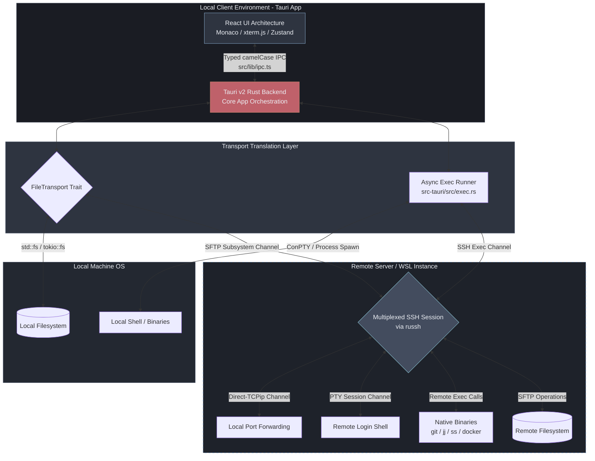

# Straylight

**In modern development, you don't always need a heavy IDE packed with background micro-services.** If you don't rely on massive extension ecosystems, Straylight is the cleaner, redesigned alternative for remote work: an **SSH file manager, embedded terminals, a tabbed code editor, and source control** all in one lightweight desktop app.

Built with **Tauri v2** (a Rust backend on the OS-native WebView) and a **React/TypeScript** frontend, Straylight runs far lighter than an Electron IDE — around **~30–50 MB of idle RAM** (versus VS Code's ~500 MB), in a **~10 MB installer**.

**Built for the AI era.** Your coding agent lives in the terminal now — so Straylight gives it a real one. Genuine system PTYs on the host mean tools like Claude Code run right where your code does, next to the files, editor, and source control they touch. A dedicated **Sessions column** docks your agents beside source control with per-agent status lights, and **F11** opens a full-window agent workspace — every session grouped by host, one keystroke from the code. (We build Straylight this way, too.)

**Status:** Runs from source (the 0.9.x test pass). Installers and binaries debut with the 0.10.0 release.

> 💡 **[Insert a high-resolution screenshot or a looping 15-second WebP/GIF here showing Local, WSL, and a Remote server side-by-side, featuring a split Monaco editor and an open terminal.]**

---

## Why Straylight Exists

VS Code's remote architecture takes over your window: connecting to a remote means downloading and running a heavy Node server, extension hosts, and language servers on your target machine, dedicating the whole UI to that single context.

Straylight is a fundamental architectural redesign. We use plain SSH and SFTP with **zero remote agents**. Because we do less per function, we can afford to do much more at once.

* **Not Kidnapped:** A single unified window manages your Local folders, up to three WSL distributions, and up to three concurrent SSH remotes side by side.
* **Pin Without Penalty:** Because Straylight doesn't charge you a massive RAM tax per context, you can pin as many directories and track as many version control repositories as you want across multiple hosts without closing things to stay fast.
* **No Remote Bloat:** No language servers, no extension hosts, no hidden daemons eating your server's CPU and memory.

---

## Key Features & Pillars

### 🛟 Instant, Crash-Safe File Saving
* **No Network Wait:** When you hit `Ctrl+S`, Straylight clears the dirty state and returns control to you *instantly*. The upload and commit run in the background, so you never wait on the link to save.
* **Staged Remote Saves:** We upload to a temporary file over SFTP, then commit it into place on the server with a native `cp` (not a rename) — designed so that a connection dropping mid-transfer won't leave you with a half-written or corrupted file.
* **Hot-Exit Drafts & Conflict Bar:** Every unsaved edit is cached locally as you type. If a file changes on the server while you are editing it, Straylight blocks the save and surfaces a **Compare / Overwrite / Discard** prompt to prevent silent clobbering.

### 🌿 Lightweight Version Control (Git & Jujutsu)
Track multiple repos across different hosts seamlessly in the left panel, keeping the UI highly active without the massive overhead.
* **Live on Git Change:** Local repositories update automatically via near-zero-cost native file watchers. For remote repositories, live-updating is an opt-in poll, keeping network round-trips strictly under your control.
* **Native Execution:** All VCS commands execute the real `git` / `jj` binary over the existing SSH connection. No local clone is required, meaning your remote `.gitconfig`, hooks, and signing keys work exactly as expected.
* **A Complete Git & jj GUI:** Side-by-side diffs, stage/commit, interactive branch history, and a native 3-way merge editor. For Jujutsu (`jj`) users, Straylight provides a view-first visualizer (status, conflicts, multi-lane history) while jj mutations are driven from the terminal. Colocated repos feature a UI badge to instantly toggle the backend.

### ⚡ Deep WSL & Resilient SSH
* **Never Gives Up:** A dropped SSH connection reconnects on its own with exponential backoff (capped at 30s) and keeps retrying until it recovers or you manually disconnect. Tabs, splits, and terminals stay alive across drops.
* **Native-Speed WSL:** Bypassing the slow `\\wsl$` bridge, Straylight auto-provisions an internal SSH server inside your WSL distro (with consent) and connects over a native `localhost` SSH link for native ext4 speed.
* **Zero-Cap Streaming Transfers:** A dedicated multi-pane transfer tool streams files directly between any two hosts (Local ⇄ WSL ⇄ Remote) with no file size limits.

### ⌨️ Professional Editor & Terminal Experience
* **Splittable Monaco Editor:** The core text editing experience is identical to VS Code (Monaco). Features up to three split groups, explicit tab pinning, sticky scroll, real-time Markdown preview (`Ctrl+Shift+V`), line-ending conversion (`LF`/`CRLF`), and a lightweight mode for massive log files.
* **Hardware-Accelerated Terminals:** `xterm.js` driving genuine system PTYs. Terminals are grouped by host with drag-reorder, and any shell can move into the **Sessions column** (or the F11 workspace) without restarting — the live terminal is reparented, never respawned.

### 🎨 Themes & Host Identity
* **Six built-in themes**, each designed end to end: **Straylight** (the crimson dark default), **Straylight Light**, Dracula, Nord, Solarized Light, and Catppuccin Latte (credits in [THIRD_PARTY_NOTICES.md](THIRD_PARTY_NOTICES.md)).
* **Everything is themeable** — every color in the UI, editor, and terminal resolves from a slot in hand-editable `settings.json`; a theme pick is pure data. No hardcoded colors anywhere.
* **Hosts wear identity colors:** Local + WSL read as a near pair, remotes as their own color family — carried consistently across the sidebar, source-control cards, tab markers, and (optionally) each terminal's cursor and selection, so you always know which machine you're touching.

---

## Architecture

Straylight achieves its efficiency by removing heavy remote agents and local clones. A single SSH connection per host is multiplexed into distinct channels. All version control commands, file-finding, and shell operations execute native binaries on the host via a custom asynchronous `exec` runner. 

Design docs live in [`docs/`](docs/README.md).



---

## Prerequisites

| Tool / Dependency | Version | Notes |
| :--- | :--- | :--- |
| **Node.js** | >= 20.19 (or >= 22.12) | Required by Vite 7 for the frontend build. Tested against Node 24. |
| **Rust** | Stable | Backend compiler. `cargo` and `rustc` must be on your PATH. |
| **C++ Build Tools** *(Windows)* | MSVC | Required for linking the Rust binary (`link.exe`). |
| **Tauri v2 System Deps** | Platform Dep | **Windows:** WebView2 (preinstalled on Win 10/11).<br>**Linux:** WebKitGTK 4.1, `libssl`, `librsvg`, `build-essential`. |

### Quick Setup for Windows C++ Build Tools
If you don't have Visual Studio installed on Windows, provision the compiler toolchain via `winget`:
```bash
winget install Microsoft.VisualStudio.2022.BuildTools --override "--quiet --wait --add Microsoft.VisualStudio.Workload.VCTools --includeRecommended"
```

---

## Getting Started

```bash
# 1. Install frontend and development dependencies
npm install

# 2. Launch the app in development mode (Vite HMR + Rust hot reload)
npm run tauri dev
```
Fira Code is **bundled** (committed under `public/fonts/`); no font fetch is required. To re-sync the font files from source, run `node scripts/fetch-fonts.mjs`.

*Note: The first `tauri dev` compiles the entire Rust backend and fetches its crate tree — this takes a few minutes. Subsequent runs use cached targets and start quickly.*

To compile production-optimized native installers:
```bash
npm run tauri build
```

---

## Core Command Matrix

| Command | Function |
| :--- | :--- |
| `npm run dev` | Runs the isolated Vite dev server in a browser context (no native backend). |
| `npm run typecheck` | TypeScript verification (`tsc --noEmit`). |
| `npm run build` | Type-checks and builds the production React bundle. |
| `npm run tauri dev` | Boots the full desktop app with UI + backend hot reload. |
| `npm run tauri build` | Packages native installers (NSIS + MSI on Windows). |
| `cargo test --manifest-path src-tauri/Cargo.toml` | Runs the Rust unit tests (config/git/jj parsers, the save-commit script, port parsing, path handling). |

---

## Primary Keyboard Shortcuts

| Keybinding | Action Context |
| :--- | :--- |
| <kbd>Ctrl</kbd> + <kbd>Shift</kbd> + <kbd>P</kbd> | Global Command Palette |
| <kbd>Ctrl</kbd> + <kbd>P</kbd> | Quick-Open Fuzzy File Search |
| <kbd>Ctrl</kbd> + <kbd>Shift</kbd> + <kbd>F</kbd> | Global Content Search Across Files |
| <kbd>Ctrl</kbd> + <kbd>S</kbd> | Save Current File |
| <kbd>Ctrl</kbd> + <kbd>W</kbd> | Close Active Tab (pinned tabs are spared) |
| <kbd>F5</kbd> / <kbd>Ctrl</kbd> + <kbd>R</kbd> | Refresh Workspace States (dirty tabs kept intact) |
| <kbd>Ctrl</kbd> + <kbd>Tab</kbd> | Contextual Switcher (editor tabs / terminal groups) |
| <kbd>Ctrl</kbd> + <kbd>`</kbd> | Toggle Bottom Terminal Panel |
| <kbd>Ctrl</kbd> + <kbd>Shift</kbd> + <kbd>`</kbd> | New Terminal (focused terminal's host, else the selected host group) |
| <kbd>F11</kbd> | Session Focus — the full-window agent workspace |
| <kbd>Ctrl</kbd> + <kbd>PageDown</kbd> / <kbd>PageUp</kbd> | Cycle Panel Terminals |
| <kbd>Ctrl</kbd> + <kbd>B</kbd> | Toggle Sidebar |
| <kbd>Ctrl</kbd> + <kbd>Shift</kbd> + <kbd>E</kbd> | Focus File Explorer |
| <kbd>Ctrl</kbd> + <kbd>Shift</kbd> + <kbd>R</kbd> | Reload the File Tree |
| <kbd>↑</kbd> <kbd>↓</kbd> <kbd>←</kbd> <kbd>→</kbd> | File Tree Navigation (<kbd>→</kbd> Expand/Enter, <kbd>←</kbd> Collapse/Parent) |
| <kbd>Enter</kbd> | Open File / Toggle Folder |
| <kbd>Ctrl</kbd> + <kbd>X</kbd> / <kbd>C</kbd> / <kbd>V</kbd> | Explorer Cut / Copy / Paste |
| <kbd>F2</kbd> | Inline Rename |
| <kbd>Del</kbd> | Delete File/Folder |

*While a terminal has focus, sequences like <kbd>Ctrl</kbd> + <kbd>C</kbd> are routed to the host shell (e.g. `SIGINT`), not captured by the window. Keybindings are fully customizable in Preferences or directly in `settings.json`.*

---

## License

Licensed under either of [Apache License, Version 2.0](LICENSE-APACHE) or [MIT license](LICENSE-MIT) at your option.

Unless you explicitly state otherwise, any contribution intentionally submitted for inclusion in Straylight by you, as defined in the Apache-2.0 license, shall be dual licensed as above, without any additional terms or conditions.
