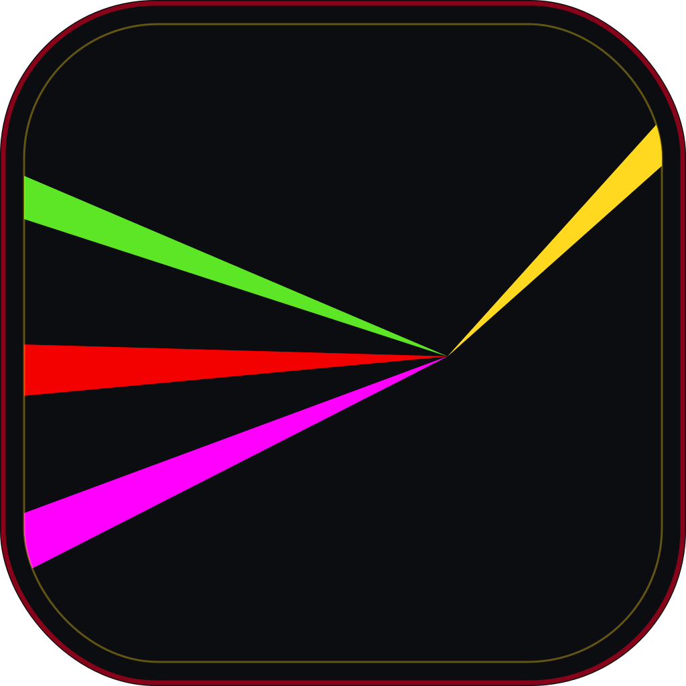
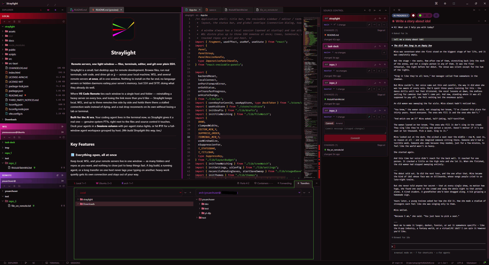
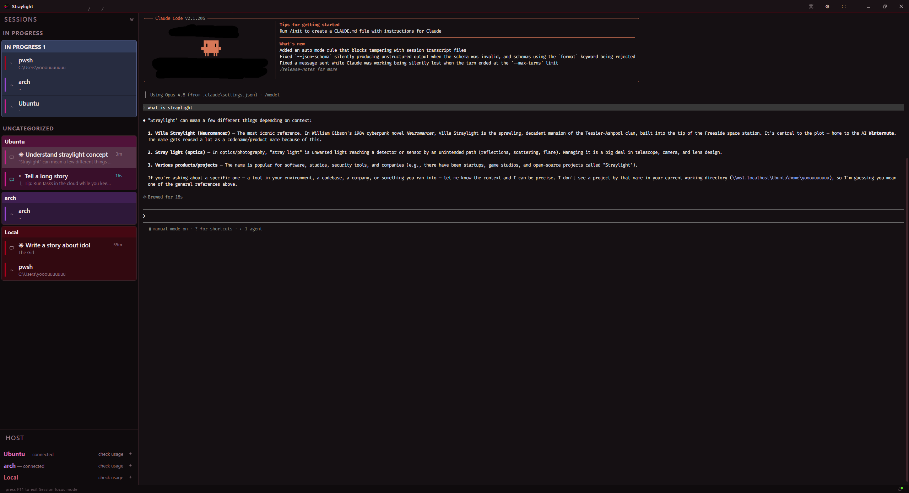
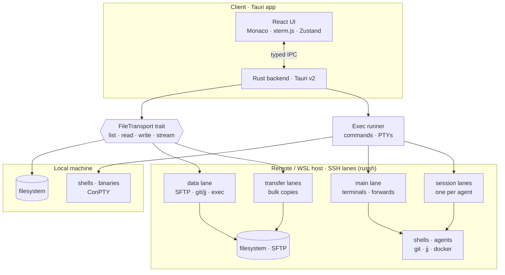

<p align="center">
  
</p>

<h1 align="center">Straylight</h1>

<p align="center"><b>Remote servers, one light window — files, terminals, editor, and git over plain SSH.</b></p>

<p align="center">
  
</p>

Straylight is a small, fast desktop app for remote development. Browse files, run real terminals, edit code, and drive git or jj — across your local machine, WSL, and several remote servers **at once**, all in one window. Nothing to install on the far end, no language servers or hidden daemons eating your server's memory. Just SSH and SFTP, doing what they already do well.

Where **VS Code Remote** ties each window to a single host and folder — reinstalling a heavy server on every box, and losing the link more than you'd like — Straylight keeps local, WSL, and up to three remotes live side by side and holds them there: a stalled connection waits instead of dying, and a real drop reconnects on its own without losing a tab or terminal.

**Built for the AI era.** Your coding agent lives in the terminal now, so Straylight gives it a real one — genuine system PTYs, right next to the files and source control it touches. Dock your agents in a **Sessions column** with per-agent status lights, or hit **F11** for a full-window agent workspace grouped by host. *(We build Straylight this way, too.)*

<p align="center">
  
  <br>
  <em>Focus mode — sessions grouped by host, or into your own groups — one keystroke from the code.</em>
</p>

---

## Key Features

### 🪟 Everything open, all at once
Keep local, WSL, and your remote servers live in one window — as many folders and repos as you want, and nothing to close just to keep things fast. A big build, a running agent, or a long transfer on one host never lags your typing on another; heavy work quietly gets its own connection and stays out of your way.

### 🛟 Saves that commit like a transaction
Saving a remote file over a shaky link is where editors quietly lose work — a half-written file, or a *"saved"* that never landed. Straylight makes every save a **handshake**: your change uploads to a staging copy, commits into place on the server, and is confirmed — a three-step deal where the connection dying at *any* step leaves your file whole, fully old or fully new, never torn in half.

And it does it without the usual trade-off. The naive way to make a save atomic is a `rename` — which silently resets your file's owner, permissions, symlinks, and hard links every single time. Straylight instead slides the new bytes into your *existing* file with `cp`, so **your file keeps its identity**. To you the whole thing is instant — `Ctrl+S` returns the moment it's dispatched and the handshake finishes in the background. A crash costs nothing either, since every unsaved edit is cached locally as you type; and if the file changed under you, the save blocks with **Compare / Overwrite / Discard** instead of clobbering it.

### 🌿 Git & Jujutsu that just work
Your real `git` and `jj`, exactly as you've set them up — hooks fire, commits sign, your `.gitconfig` is honored — because Straylight runs your actual tools on the host that owns the repo, not a reimplementation that gets the details subtly wrong. Full side-by-side diffs, stage/commit, branch history, and a 3-way merge editor for git, plus a clean view-first take for jj. Track as many repos across as many hosts as you like.

### ⚡ Connections that stay up, transfers that finish
Your links don't drop out from under you: a stalled connection is held open and waited on, not killed on suspicion, and a genuine drop reconnects on its own without losing a tab or terminal. WSL runs at full native speed. Transfers move about **twice as fast as `scp`**, pause and resume across drops, and can be throttled so a big copy never crowds out your work. You can even copy straight between two remote hosts — which VS Code can't do at all — and your keys never leave the app to make it happen.

### ⌨️ The editor and terminal you already know
The editor is Monaco — VS Code's own — so multi-cursor, sticky scroll, Markdown preview, and even huge log files all feel exactly right. The terminals are real system shells, grouped by host, and any of them can slide into a dedicated **Sessions** workspace (or the full-window **F11** view) to sit beside your agents — without ever restarting the shell.

### 🎨 Themes that go all the way down
Six themes designed end to end — Straylight's crimson-dark default and its light twin, plus Dracula, Nord, Solarized, and Catppuccin Latte. Everything is themeable from one hand-editable file, UI to editor to terminal, with no hardcoded colors anywhere. And every host wears its own color across the whole app, so you always know which machine you're touching.

---

## Install

**Windows 10 / 11.** Download the installer (`Straylight_…_x64-setup.exe`, ~7 MB) from the [latest release](https://github.com/Yooouuuuuuu/straylight/releases/latest) and run it — it installs per-user with no admin prompt and nothing else to set up.

It isn't code-signed yet, so on first launch Windows SmartScreen shows **"Windows protected your PC."** Click **More info → Run anyway** — a one-time click; the installed app never asks again. 

From there Straylight **updates itself**: new releases download and install in the background, with your OK.

> **macOS and Linux** aren't packaged yet — [build from source](#building-from-source) to run them today; the plan is in [future work](docs/future-work.md).

---

## Primary Keyboard Shortcuts

| Keybinding | Action Context |
| :--- | :--- |
| <kbd>Ctrl</kbd> + <kbd>Shift</kbd> + <kbd>P</kbd> | Global Command Palette |
| <kbd>Ctrl</kbd> + <kbd>P</kbd> | Quick-Open Fuzzy File Search |
| <kbd>Ctrl</kbd> + <kbd>Shift</kbd> + <kbd>F</kbd> | Global Content Search Across Files |
| <kbd>Ctrl</kbd> + <kbd>B</kbd> | Toggle Sidebar |
| <kbd>Ctrl</kbd> + <kbd>Shift</kbd> + <kbd>G</kbd> | Toggle Source Control |
| <kbd>Ctrl</kbd> + <kbd>Alt</kbd> + <kbd>I</kbd> | Toggle Sessions Column |
| <kbd>Ctrl</kbd> + <kbd>`</kbd> / <kbd>Ctrl</kbd> + <kbd>J</kbd> | Toggle Bottom Terminal Panel |
| <kbd>F11</kbd> | Session Focus — the full-window agent workspace |
| <kbd>Ctrl</kbd> + <kbd>S</kbd> | Start Saving transaction |

*The most-used ones. Open the **Command Palette** (<kbd>Ctrl</kbd> + <kbd>Shift</kbd> + <kbd>P</kbd>) in the app to browse **every** command with its shortcut, and rebind any of them in Preferences or `settings.json`. (While a terminal is focused, keys like <kbd>Ctrl</kbd> + <kbd>C</kbd> go to the shell, not the app.)*

---

## Architecture

Straylight achieves its efficiency by removing heavy remote agents and local clones. Each host runs a few purpose-tuned SSH connections — the lanes ([docs/connections.md](docs/connections.md)) — so terminals, file traffic, agents, and transfers can't hurt each other. All version control commands, file-finding, and shell operations execute native binaries on the host via a custom asynchronous `exec` runner. 

Design docs live in [`docs/`](docs/README.md).



---

## Building from source

Most people just install Straylight from the [latest release](https://github.com/Yooouuuuuuu/straylight/releases) — building from source is for hacking on it or running the newest unreleased commit.

### Prerequisites

| Tool / Dependency | Version | Notes |
| :--- | :--- | :--- |
| **Node.js** | >= 20.19 (or >= 22.12) | Required by Vite 7 for the frontend build. Tested against Node 24. |
| **Rust** | Stable | Backend compiler. `cargo` and `rustc` must be on your PATH. |
| **C++ Build Tools** *(Windows)* | MSVC | Required for linking the Rust binary (`link.exe`). |
| **Tauri v2 System Deps** | Platform Dep | **Windows:** WebView2 (preinstalled on Win 10/11).<br>**Linux:** WebKitGTK 4.1, `libssl`, `librsvg`, `build-essential`. |

On Windows without Visual Studio, provision the C++ toolchain via `winget`:
```bash
winget install Microsoft.VisualStudio.2022.BuildTools --override "--quiet --wait --add Microsoft.VisualStudio.Workload.VCTools --includeRecommended"
```

### Run & build

```bash
npm install          # frontend + dev dependencies
npm run tauri dev    # launch the app (Vite HMR + Rust hot reload)
npm run tauri build  # package native installers (NSIS + MSI on Windows)
```

Fira Code is **bundled** (committed under `public/fonts/`) — no font fetch needed; re-sync with `node scripts/fetch-fonts.mjs` if you change them. The first `tauri dev` compiles the whole Rust backend (a few minutes); later runs use cached targets. Run the Rust tests with `cargo test --manifest-path src-tauri/Cargo.toml`.

---

## License

Licensed under either of [Apache License, Version 2.0](LICENSE-APACHE) or [MIT license](LICENSE-MIT) at your option.

Unless you explicitly state otherwise, any contribution intentionally submitted for inclusion in Straylight by you, as defined in the Apache-2.0 license, shall be dual licensed as above, without any additional terms or conditions.
